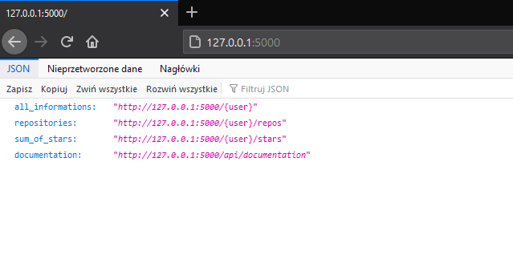
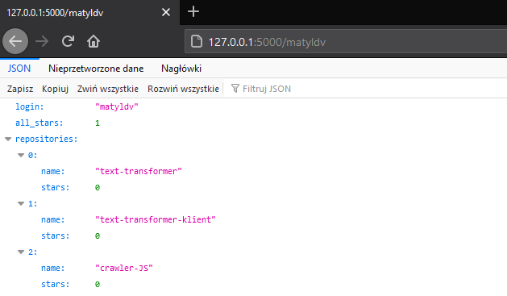
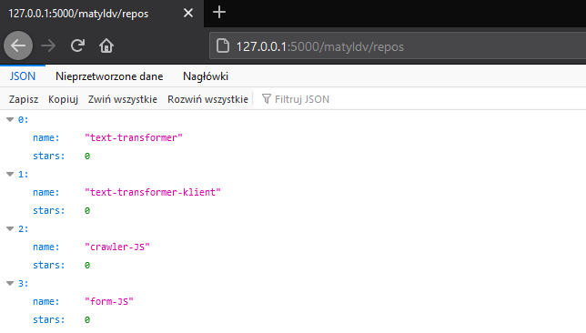
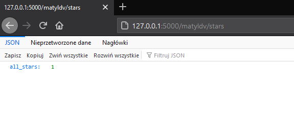
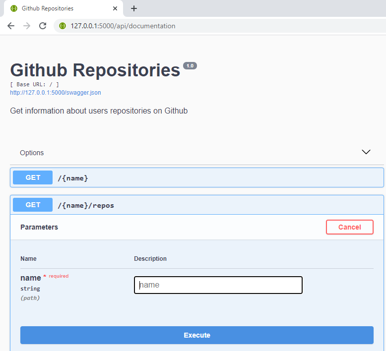

# Github Repositories API
>Get list of users repositories with amount of earned stars


## Contents

* [General](#general)
* [Setup](#setup)
  * [Docker ](#first-method-using-docker)
  * [pip](#second-method-using-pip)
* [Usage](#usage)
* [Technologies](#technologies)
* [Tests](#tests)
* [Comments](#Comments)
* [Further ideas](#further-ideas)

## General
This project is a small API, which allows to list specific user repositories and information about number of stars. 
To get any information you can enter the address of page or use Swagger.  
All data are returned in JSON format.   

Information about user's repositories is taken from [Github API](https://api.github.com/)
## Setup

### First method: using Docker
> Note: Requires [Docker](https://www.docker.com/get-started) and [Docker Compose](https://docs.docker.com/compose/) to run.

Clone repository
```
git clone REPO
```
Open repo directory
```
cd github-repo-api
```
>It is recommended to set APP_GITHUB_TOKEN in .env file at this point, check [comments](#Comments)  

Build image and run container (detached mode is recommended)
```
docker-compose up -d --build
```
To kill container use
```
docker-compose down
```

### Second method: using pip
> Note: Requires [Python](https://www.python.org/)3 and pip to run.

Clone repository
```
git clone REPO
```
Open code directory
```
cd github-repo-api/code
```
Install virtualenv
```
pip install virtualenv
```
Go to the project folder and create a virtual environment
```
virtualenv -p python3 venv
```
Active your virtual environment
```
venv\Scripts\activate
```
Install all requirements modules
```
pip install -r requirements.txt
```
>It is recommended to set APP_GITHUB_TOKEN in run_server.py at this point, check [comments](#Comments)  

Run project
```
python run_server.py
```
To stop server
```
Ctrl + C
```
To deactivate
```
deactivate
```

## Usage


Verify the deployment by navigating to your server address in
your preferred browser.
>Note: Default server works on 127.0.0.1:5000
```sh
http://127.0.0.1:5000
```
 

* ## /
On this page are listed all avaliable options    



* ## /{user}
After entering the username, all information is displayed   



* ## /{user}/repos
After entering the username, a list of repositeories is displayed   



* ## /{user}/stars
After entering the username, the sum of the stars from all repositories is is displayed.   



* ## /api/documentation

Swagger: API Documentation   
Here is all information about API's abilities and the data that is returned. 



## Technologies
#


| Name | Version |
| ------ | ------ |
| Python | 3.9.1 |
| Flask | 1.1.2 |
| Flask-RESTPlus |0.13.0 |
| Requests | 2.25.1 |
| Werkzeug | 0.16.0 |   

## Tests
#

After starting the server you can also run some tests.
If you are using docker use this command and the next one
```
docker exec -it github-repo-api sh
```
```
python tests/test_app.py
```
## Comments
Github API has rate limit 60 request per hour. In order to increase the API rate limit you might authenticate yourself at [Github](https://github.com/settings/tokens) and set your token as APP_GITHUB_TOKEN environment variable 
If you enter your token incorrectly, the server will not let you in.
```json
{"error": "unauthorized", "error_msg": "Unauthorized, Github token is invalid"}
```

## Further ideas
* add more unit tests
* add integration tests
* develepo more functionality
  * get more informations about repositories
  * get informations about users who gave a star
  * entering token by POST  

